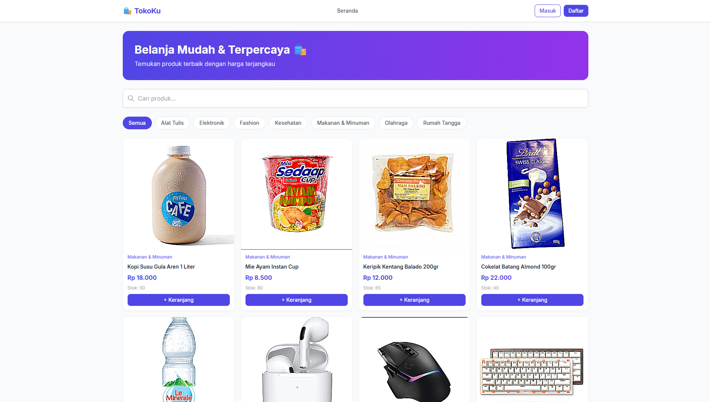
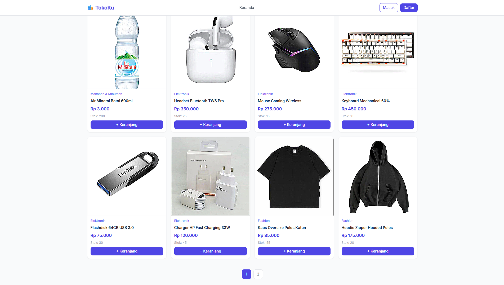
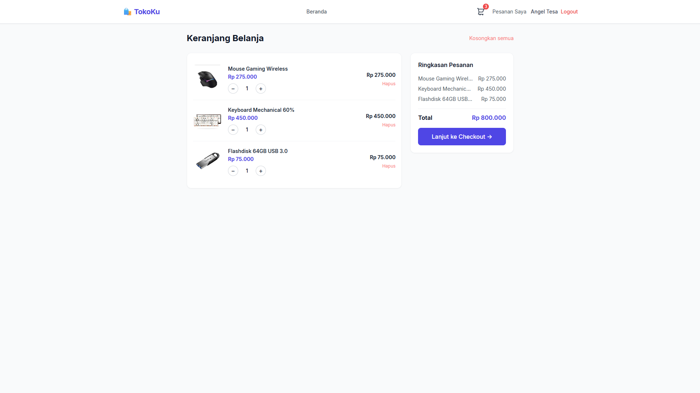

<div align="center">
  <h1>🛍️ TokoKu</h1>
  <p>
    
  </p>
  <p>
    <a href="#-features"></a>
    <a href="#-tech-stack"></a>
    <a href="#-tech-stack"></a>
    <a href="LICENSE"></a>
  </p>
</div>

---

## ✨ Features

- 🔐 **User Authentication** – Register, login, JWT‑based authorization, role protection (User / Admin).
- 🛒 **Shopping Cart** – Add products, update quantity, remove items, and checkout.
- 📦 **Product Management** – Admin can create, edit, delete products and manage stock.
- 🔍 **Search & Filter** – Search by name or filter by category.
- 🖼️ **Image Upload** – Product images stored on server via multer.
- 👤 **Admin Dashboard** – Manage users and products from a dedicated dashboard.
- 🛡️ **Security** – Password hashing with bcryptjs, protected API routes.
- 📱 **Responsive** – Built with Tailwind CSS, works perfectly on desktop and mobile.

---

## 🛠️ Tech Stack

| Layer       | Technology |
|-------------|------------|
| **Frontend**| React 18, Vite, Tailwind CSS, React Router, Context API, react-hot-toast |
| **Backend** | Node.js, Express, JWT, bcryptjs, multer |
| **Database**| MySQL (mysql2/promise) |
| **Tools**   | Git, Nodemon, Postman |

---

## 📸 Screenshots

<div align="center">
  <table>
    <tr>
      <td></td>
      <td></td>
      <td></td>
    </tr>
    <tr align="center">
      <td>🏠 Home Page</td>
      <td>🛍️ Products</td>
      <td>🛒 Cart</td>
    </tr>
  </table>
</div>

---

## 📁 Project Structure

```
TokoKu/
├── frontend/
│   ├── src/
│   │   ├── components/     # Navbar, ProductCard, etc.
│   │   ├── contexts/       # AuthContext, CartContext
│   │   ├── pages/          # Home, Login, Dashboard, etc.
│   │   ├── App.jsx
│   │   └── main.jsx
│   ├── public/
│   └── index.html
├── backend/
│   ├── config/             # DB connection
│   ├── controllers/        # Auth & Product logic
│   ├── middleware/          # auth, adminOnly, upload
│   ├── models/             # User, Product
│   ├── routes/             # auth, products
│   └── server.js
├── database/               # MySQL schema & seed data
└── secure_env_backup/      # Environment variable backup
```

---

## 🚀 Getting Started

### Prerequisites
- Node.js 18+
- MySQL (or XAMPP)
- Git

### 1. Clone the repository
```bash
git clone https://github.com/Gbrnd-ux/TokoKu.git
cd TokoKu
```

### 2. Backend Setup
```bash
cd backend
npm install
```

Create a `.env` file based on `secure_env_backup/`:
```env
DB_HOST=localhost
DB_USER=root
DB_PASS=
DB_NAME=tokoku
JWT_SECRET=tokoku_secret_key
PORT=5000
```

Run the server:
```bash
npm run dev
```
Server runs at `http://localhost:5000`.

### 3. Frontend Setup
```bash
cd ../frontend
npm install
npm run dev
```
Open `http://localhost:5173` in your browser.

### Demo Accounts
| Role  | Email                 | Password  |
|-------|-----------------------|-----------|
| Admin | admin@tokoku.com      | admin123  |
| User  | user@tokoku.com       | user123   |

---
